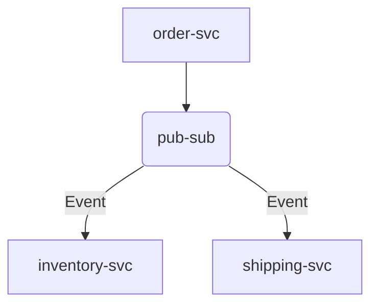

# Dapr Quarkus Demo

A basic skeleton README you can edit and expand. It outlines common sections and a few Quarkus + Dapr specifics used in this repo.

## Table of Contents
- [Overview](#overview)
- [Architecture](#architecture)
- [Tech Stack](#tech-stack)
- [Prerequisites](#prerequisites)
- [Quick Start](#quick-start)
- [Configuration](#configuration)
- [Local Development](#local-development)
- [Testing](#testing)
- [Build](#build)
- [Run with Docker](#run-with-docker)
- [Run with Dapr](#run-with-dapr)
- [API](#api)
- [Environment Variables](#environment-variables)
- [Troubleshooting](#troubleshooting)
- [Contributing](#contributing)
- [License](#license)

## Overview
Short summary of what this project demonstrates (e.g., a microservice using Quarkus with Dapr building blocks like pub/sub and state store).

## Architecture
High-level description and (optionally) a diagram of services and Dapr components.



- Services:
  - `order-service/` — handles order creation and updates
- Dapr components:
  - `components/` — pub/sub, state store, and subscription YAMLs

## Tech Stack
- Language/Runtime: Java (Quarkus)
- Build tool: Gradle
- Container: Docker (optional)
- Dapr: sidecar runtime for building blocks (pub/sub, state, bindings)

## Prerequisites
- Java 17+
- Gradle (wrapper included)
- Dapr CLI (for Dapr examples)
- Docker (optional, for container build)

## Quick Start
Clone and run the service in dev mode.

```bash
# 1) Clone
git clone https://github.com/your-org/dapr-quarkus-demo.git
cd dapr-quarkus-demo

# 2) Run order-service in Quarkus dev mode
cd order-service
./gradlew quarkusDev
```

## Configuration
- Quarkus app config: `order-service/src/main/resources/application.properties`
- Dapr component files: `components/*.yaml`
  - Update component metadata (e.g., connection strings) as needed for your environment.

## Local Development
Useful Gradle commands (run from `order-service/` directory):

```bash
./gradlew quarkusDev      # hot reload dev mode
./gradlew test            # run tests
./gradlew build           # build artifacts
```

## Testing
Run unit/integration tests for `order-service`:

```bash
cd order-service
./gradlew test
```

## Build
Build the application JARs:

```bash
cd order-service
./gradlew build
```

Artifacts will be under `order-service/build/` (for Quarkus, see `build/quarkus-app/`).

## Run with Docker
Example using the provided Dockerfiles (from `order-service/`):

```bash
cd order-service
# JVM image
docker build -f src/main/docker/Dockerfile.jvm -t order-service:latest .
docker run --rm -p 8080:8080 --name order-service order-service:latest
```

## Run with Dapr
Run the service with a Dapr sidecar using the components in `./components` (from repo root):

```bash
# Terminal 1: start the app (dev mode)
cd order-service
./gradlew quarkusDev

# Terminal 2: run Dapr sidecar (match app-id and port)
cd ..
dapr run \
  --app-id order-service \
  --app-port 8080 \
  --resources-path ./components \
  --components-path ./components \
  --log-level info \
  --config "" \
  -- bash -c "sleep 86400"
```

Alternatively, run a packaged JAR with Dapr:

```bash
cd order-service
./gradlew build
cd ..
dapr run \
  --app-id order-service \
  --app-port 8080 \
  --resources-path ./components \
  --components-path ./components \
  -- java -jar order-service/build/quarkus-app/quarkus-run.jar
```

## API
- Document key endpoints and link to OpenAPI/Swagger if available.
- Example:

```bash
curl http://localhost:8080/q/health
```

## Environment Variables
| Name | Description | Default |
|------|-------------|---------|
| `QUARKUS_HTTP_PORT` | HTTP port for Quarkus | `8080` |
| `JAVA_OPTS` | Extra JVM options | — |

Add any Dapr-related environment variables here as needed.

## Troubleshooting
- Ensure Dapr sidecar is installed and initialized: `dapr init`
- Check component configurations under `components/`
- View logs for the app and Dapr sidecar for errors

## Contributing
- Issues and PRs welcome. Please follow conventional commit messages and format code consistently.

## License
Specify your license (e.g., MIT, Apache-2.0).
